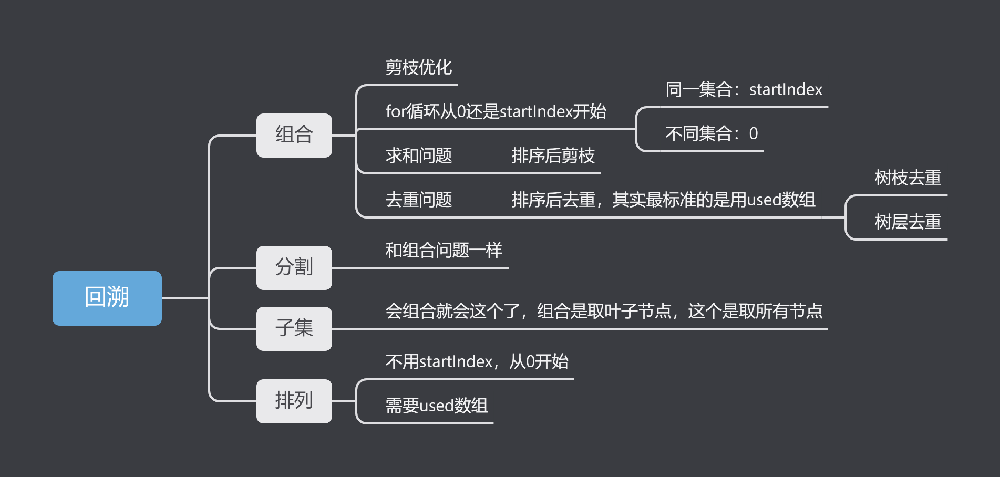
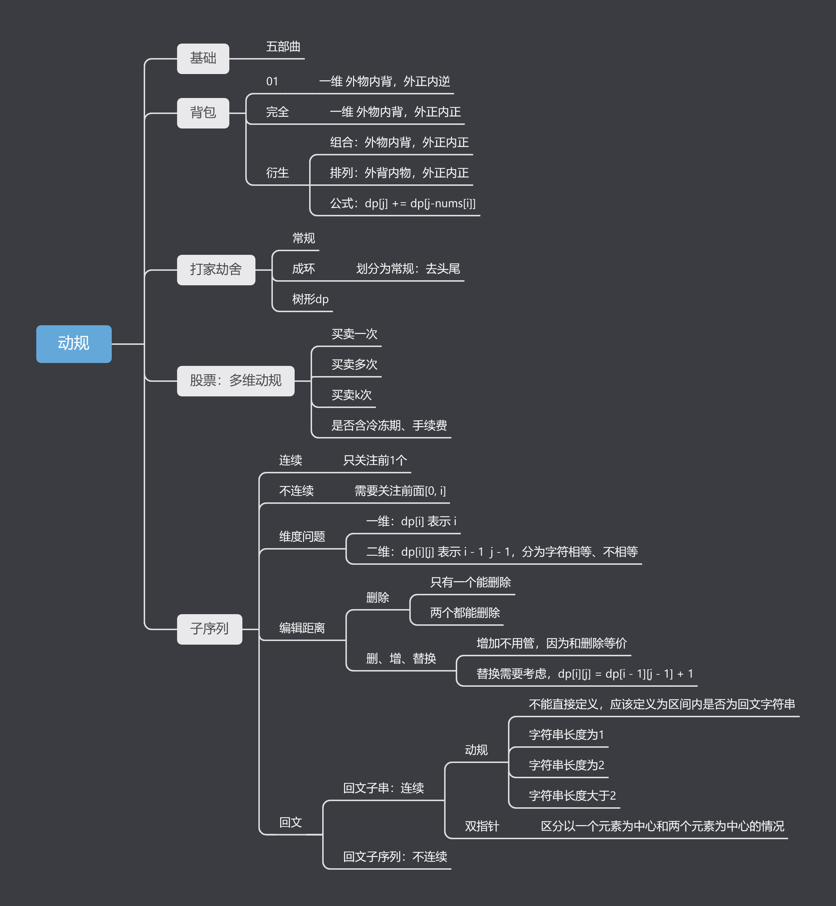

# algorithm

所有文章均参考自代码随想录！ 

题解：[代码随想录](https://github.com/youngyangyang04/leetcode-master) 
acm模式练习：[卡码网](https://kamacoder.com/) 

# 常考算法

## 字符串

[字符串](doc/%E5%AD%97%E7%AC%A6%E4%B8%B2.md) 

## 排序算法
[常见排序算法](doc/%E5%B8%B8%E8%A7%81%E6%8E%92%E5%BA%8F%E7%AE%97%E6%B3%95.md) 

## 回溯

 

## 动规

 